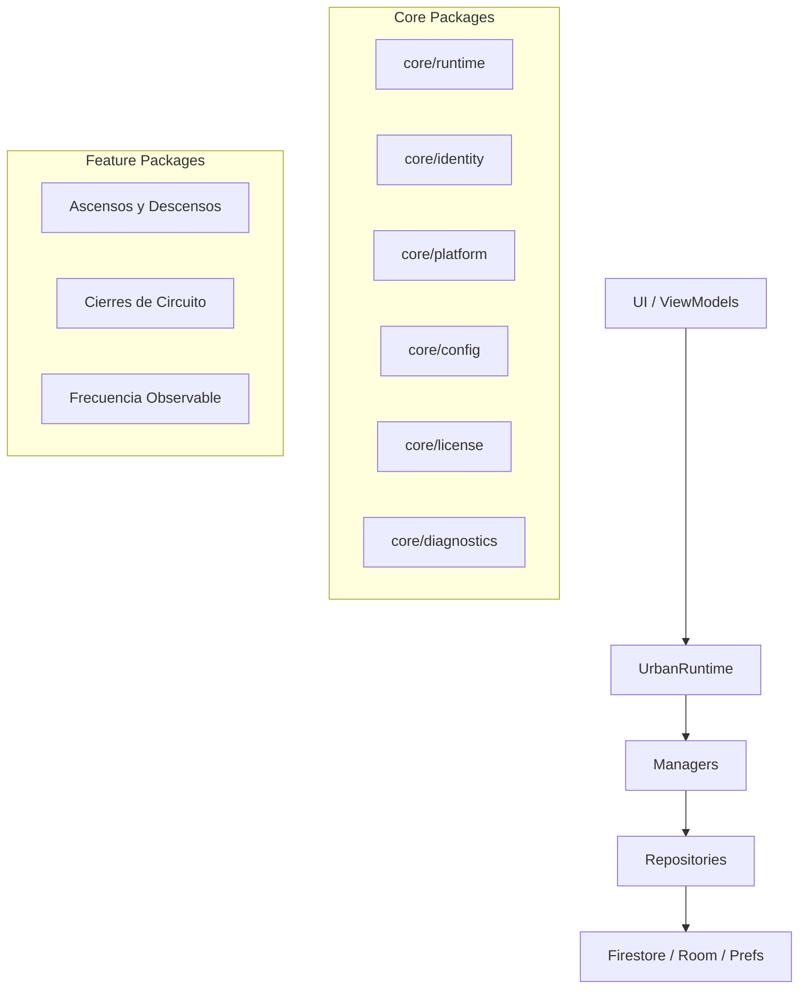

# Urban Platform - Architecture Guide

This document describes the architectural principles and structure of the Urban Platform Android application as of the end of Sprint 1.

## Architectural Principles

1.  **Facade Pattern**: `UrbanRuntime` is the unique public entry point (facade) for all infrastructure and platform services.
2.  **Layer Separation**:
    -   **UI Layer**: Jetpack Compose screens and ViewModels.
    -   **Domain/Service Layer**: Managers and repositories.
    -   **Infrastructure Layer**: SharedPreferences, Firestore, Room, GPS, and Identity.
3.  **Encapsulation**: UI should never access DAOs, SharedPreferences, or Firebase directly. All infrastructure calls must pass through `UrbanRuntime`.
4.  **Error Handling**: `UrbanRuntime` must be exception-safe, protecting the UI from infrastructure-level crashes.

---

## Component Overview

### UrbanRuntime
The central facade for the application. It provides access to:
- **Identity**: Installation IDs and device metadata.
- **Platform**: Organization and Project context.
- **Sync**: Triggers and monitoring for cloud synchronization.
- **Diagnostics**: Health checks and system status snapshots.
- **Configuration**: Remote and local settings.
- **Licensing**: Access control for modules and features.

### Managers (core/runtime)
Internal components that coordinate specific domains:
- `UrbanIdentityManager`: Manages device identification.
- `UrbanPlatformManager`: Handles organization and project settings.
- `UrbanSyncManager`: Coordinates data synchronization.
- `UrbanConfigurationManager`: Manages remote and local config.
- `UrbanLicenseManager`: Validates licenses and feature access.

### Cloud & Sync (core/platform/sync & asd/sync)
- **CloudSyncEngine**: The core logic for processing the sync queue.
- **UrbanCloudSyncScheduler**: Coordinates the background execution of sync tasks.
- **FirestoreCloudSyncTarget**: Implementation of the sync target for Firebase Firestore.

### Identity (core/identity)
Encapsulates the generation and persistence of the `UrbanDeviceIdentity`, ensuring every installation has a unique and persistent ID.

### Diagnostics (core/diagnostics)
Provides a unified view of the system's health, including battery, network, permissions, and sync status. It is designed to be exception-safe.

---

## Dependency Graph & Package Structure

### Package Structure
- `com.oropeza.urbanapp.core`: Foundational platform code.
- `com.oropeza.urbanapp.asd`: Features related to "Ascensos y Descensos".
- `com.oropeza.urbanapp.cc`: Features related to "Cierres de Circuito".
- `com.oropeza.urbanapp.fov`: Features related to "Frecuencia Observable".
- `com.oropeza.urbanapp.navigation`: Navigation host and main entry points.

---

## Technical Debt & Recommendations (Sprint 1 Audit)

1.  **Refactor AsdGraph**: The UI layer still has direct dependencies on `AsdGraph`. These should be migrated to `UrbanRuntime` or Feature-specific ViewModels.
2.  **Naming Consistency**: Rename ambiguous files (e.g., `repository.kt`, `dao.kt`, `entities.kt`) to include domain prefixes (e.g., `AsdRepository.kt`).
3.  **Common Interface for Managers**: Consider implementing an `UrbanManager` interface for lifecycle or initialization management.
4.  **Firestore Isolation**: Ensure that only `FirestoreCloudSyncTarget` and `UrbanPlatformRepository` have direct dependencies on Firebase Firestore.
